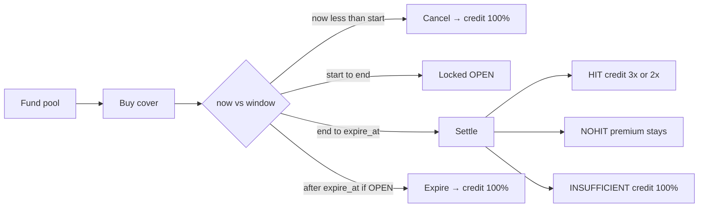
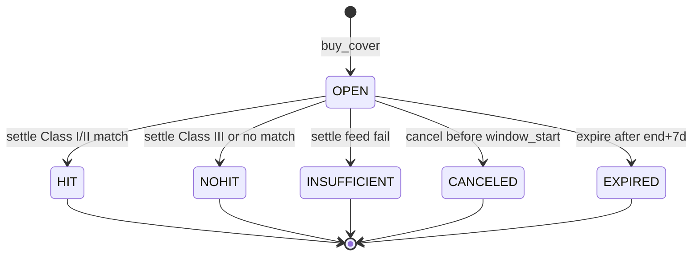

# RecallLine

Parametric FDA recall cover on **GenLayer Studio Next**.

A buyer locks test GEN against **one product identity** and **one future UTC window**. After the window closes, **anyone** calls `settle`. Validators fetch official **openFDA** JSON from a URL **the contract built**. The contract returns `HIT` | `NOHIT` | `INSUFFICIENT` and moves value in that write.

Not a court. No jury. No appeal. Not BackIt, Rainline, Remediate/OSV, or LicenseLock.

---

## Live deployment (Studio Next)

| | |
|---|---|
| Network | Studio Next / `studio-dev` |
| Chain ID | **61997** (`0xF22D`) — not `0xF21D` (61981), not studionet **61999** |
| RPC | `https://studio-dev.genlayer.com/api` |
| Explorer | [explorer-studio-dev.genlayer.com](https://explorer-studio-dev.genlayer.com/) |
| Faucet | [studio-dev.genlayer.com](https://studio-dev.genlayer.com) |
| Intelligent contract | [`0x5BB332c39D0578aF6CFaa67716B6af024aeD5c52`](https://explorer-studio-dev.genlayer.com/address/0x5BB332c39D0578aF6CFaa67716B6af024aeD5c52) |
| Deploy tx | [`0xd8054a9c4dcc80167634700b80745b309bed710d0be78aee42ce66b6b032338e`](https://explorer-studio-dev.genlayer.com/tx/0xd8054a9c4dcc80167634700b80745b309bed710d0be78aee42ce66b6b032338e) |
| Deploy result | **FINALIZED** · **FINISHED_WITH_RETURN** · **MAJORITY_AGREE** |
| Runner | `py-genlayer:5jycge4q8k23462jtb0b9fyey1s9qz928sz2nbrd9mg4sxqg2qng` (GenVM v0.3.0-rc7) |
| JS | `genlayer-js@2.0.0-rc.1` chain `studioDevnet` |
| Kit | `@genlayer/transaction-kit@0.1.0-rc.2` |
| CLI | `genlayer@0.40.0-rc.3` |

Contract source: [`contracts/recallline.py`](contracts/recallline.py)

---

## What it does





IDs are **SHA-256 hashes** correlated to the buy transaction. The UI never assigns `COVER-0001`.

Templates: `DRUG_NDC` · `DRUG_NAME` (brand\|generic) · `DEVICE_PRODUCT_CODE`.

Economics (protocol fee **0**):

| Outcome | Money |
|---|---|
| Class I HIT | **3×** premium credited |
| Class II HIT | **2×** premium credited |
| Class III or no match | **NOHIT** — premium stays in the pool |
| INSUFFICIENT / CANCELED / EXPIRED | **100%** credited |
| `withdraw()` | Pays credit to the caller; failed transfer **reverts and keeps credit** |

Buy gates: 24h before `window_start`, window **1–14 days**, 30-day Class I/II lookback reject, pool available ≥ **2×** premium, **no buyer URL**.

Settle: contract builds the openFDA URL, 32 KiB cap, scan ≤ 10 results including earlier rows, optional LLM only for `DRUG_NAME` punctuation ties.

---

## On-chain proof (this contract)

Recorded against `0x5BB332c39D0578aF6CFaa67716B6af024aeD5c52`:

| Action | Result |
|---|---|
| Deploy | [tx `0xd8054a9c…338e`](https://explorer-studio-dev.genlayer.com/tx/0xd8054a9c4dcc80167634700b80745b309bed710d0be78aee42ce66b6b032338e) FINALIZED + FINISHED_WITH_RETURN |
| `fund_pool` | Pool deposited **30 tGEN** |
| `buy_cover` | OPEN cover `0xb762c135f066691a4196c8fc8fe763098d1ee7a577aacf3e9941835a165b2343` · NDC `00000-0000-00` · window `2026-09-21Z`→`2026-09-23Z` · premium 10 |
| `cancel` | Status **CANCELED** · refund **10 tGEN** booked · `get_credit` **10 tGEN** · reserved **0** · available **30** |
| Reads | `get_cover` / `list_ids` / `get_economics` / `get_credit` match those numbers |

`buy_cover` already runs the same **openFDA `web.get` lookback** path settle uses.

**Live `settle`:** the 24h buy gate means a new cover cannot be settled the same minute it is bought. Direct tests below **do** run settle (time warp). On Studio, after `window_end`, anyone can settle. Fake NDCs (`00000-0000-00`, `99999-1111-11`) are expected **NOHIT** (no EOA payout in that write). `/buy` has one-click settle examples with a 1-day window starting ≥ now+25h.

**`withdraw` to the wallet on Studio Next:** not finalizing today. Leader returns `FINISHED_WITH_RETURN` and emits the EOA value message; the validator committee is empty (`max_generic_retries_exceeded`) and the tx is **CANCELED**. Credit is **kept**. Studio does not model ghost-contract EOA transfers the way a full GenLayer chain does. Use `withdraw()` on a network with real ghosts.

---

## App

Next.js 15 App Router in `web/`. Stitch hardware UI. Wallet: EIP-6963 + `window.ethereum` (MetaMask, Rabby, Coinbase, Brave, OKX, Trust, in-app browsers). Connect adds/switches **61997**. `/api/genlayer` proxies JSON-RPC **reads** if CORS blocks the RPC; **signatures stay in the wallet**.

| Route | |
|---|---|
| `/` | Landing |
| `/buy` | Buy + settle example fills |
| `/pool` | Fund + economics |
| `/browse` | All covers |
| `/cover/[id]` | Cancel / settle / expire |
| `/me` | My covers + credits |
| `/how` | Spec |

Local:

```bash
cd web
cp .env.example .env.local
npm install
npm run build
npm run start
```

Open [http://localhost:3000](http://localhost:3000). Switch the wallet to chain **61997**.

---

## Vercel (from this GitHub repo)

1. Import [github.com/edwarderlick/recalline](https://github.com/edwarderlick/recalline).
2. **Root Directory:** `web` (required — the Next app is not at repo root).
3. Framework: Next.js. Build `npm run build`. Output default.
4. Environment variables (all **non-secret**):

| Name | Value |
|---|---|
| `NEXT_PUBLIC_CONTRACT_ADDRESS` | `0x5BB332c39D0578aF6CFaa67716B6af024aeD5c52` |
| `NEXT_PUBLIC_CHAIN_ID` | `61997` |
| `NEXT_PUBLIC_STUDIO_RPC` | `https://studio-dev.genlayer.com/api` |
| `NEXT_PUBLIC_STUDIO_EXPLORER` | `https://explorer-studio-dev.genlayer.com/` |
| `GENLAYER_STUDIO_URL` | `https://studio-dev.genlayer.com/api` |

5. Do **not** set studionet `61999`. Do **not** add private keys or mnemonics.
6. After deploy, confirm `/buy`, `/pool`, and CONNECT WALLET on desktop Chrome + an injected wallet.

Details: [`web/VERCEL.md`](web/VERCEL.md).

---

## Tests

```bash
python -m pytest tests/direct -q
```

**26 passed** (direct / GenVM mock, time warp). That is how HIT 3×, Class II 2×, settle, expire, and withdraw-on-fail are proven.

| Test | Asserts |
|---|---|
| `test_five_concurrent_buy_cover_distinct_hash_ids` | Five buys → five distinct hash ids |
| `test_buy_inside_window_reverts` | Cannot buy inside the window |
| `test_buy_less_than_24h_before_start_reverts` | 24h gate |
| `test_window_over_14_days_reverts` | Max 14 days |
| `test_vague_drug_name_reverts` | DRUG_NAME needs brand and generic |
| `test_bad_ndc_and_empty_device_reverts` | Bad NDC / empty device code |
| `test_buy_empty_pool_reverts` | Need 2× reserve |
| `test_lookback_class_i_ii_reverts` | Recent Class I/II blocked |
| `test_fund_then_buy_reserves_capacity` | Pool reserved = 2× premium |
| `test_class_i_hit_3x_balances_move` | **Settle HIT Class I → 3×** |
| `test_class_ii_hit_2x` | **Settle HIT Class II → 2×** |
| `test_class_iii_only_nohit_premium_stays` | **Settle Class III → NOHIT** |
| `test_no_match_nohit` | **Settle no row → NOHIT** |
| `test_oversize_missing_meta_non_json_insufficient_refund` | **Settle INSUFFICIENT → 100% refund** |
| `test_wrong_ndc_nohit_not_hit` | Wrong NDC is NOHIT, not HIT |
| `test_cancel_before_start_refunds` | Cancel → CANCELED + credit |
| `test_cancel_after_start_reverts` | `now < window_start` |
| `test_settle_before_end_reverts` | `now >= window_end` |
| `test_settle_twice_reverts` | OPEN only |
| `test_expire_before_grace_reverts_after_grace_refunds` | Expire after end+7d |
| `test_fake_id_cannot_withdraw_or_settle` | Unknown id / no credit |
| `test_transfer_fail_credits_withdraw_keeps_on_fail` | Payout fail → credit; withdraw fail keeps credit |
| `test_scan_ten_results_considers_earlier_entries` | Scan includes earlier of 10 rows |
| `test_kind_template_cannot_change_multipliers` | Multipliers immutable |
| `test_buyer_cannot_pass_url` | No buyer URL |
| `test_list_ids_matches_get_cover_ids` | Same id list |

Manual Studio checklist (also printed as fill-buttons on `/buy`):

1. Connect wallet → add **61997** if prompted.
2. `/pool` deposit ≥ **30** tGEN.
3. `/buy` → example **NOHIT · DRUG_NDC** `00000-0000-00` · premium **10**.
4. Cover page shows hash id, OPEN, Cancel enabled, Settle disabled.
5. Cancel now (credit) **or** wait until `window_end` and Settle (expected **NOHIT**).
6. `/me` shows CANCELED / credit. Wallet `withdraw` may not finalize on Studio Next (see above).

---

## Contract methods

| Method | Kind |
|---|---|
| `fund_pool()` | payable write |
| `buy_cover(template, product_key, window_start_utc, window_end_utc)` | payable write → hash id |
| `cancel(id)` | write, buyer only, before `window_start` |
| `settle(id)` | write, anyone, `window_end ≤ now < expire_at` |
| `expire(id)` | write, anyone, OPEN and `now ≥ expire_at` |
| `withdraw()` | write, pays `credits[msg.sender]` |
| `get_cover(id)` | view |
| `list_ids()` / `get_cover_ids()` | view |
| `get_economics()` | view |
| `get_credit(addr)` | view |

Redeploy (optional):

```bash
genlayer deploy --contract contracts/recallline.py --fee-profile fee-profile.json --rpc https://studio-dev.genlayer.com/api
```

Then set `NEXT_PUBLIC_CONTRACT_ADDRESS` to the new address.

---

## Repo layout

```
contracts/recallline.py   Intelligent contract
web/                      Next.js app (Vercel root)
tests/direct/             26 pytest cases
tests/fixtures/           openFDA JSON fixtures
scripts/                  deploy / smoke helpers
fee-profile.json          Consensus v0.6 fee profile
gltest.config.yaml        studio_devnet 61997
```

---

## License

MIT
